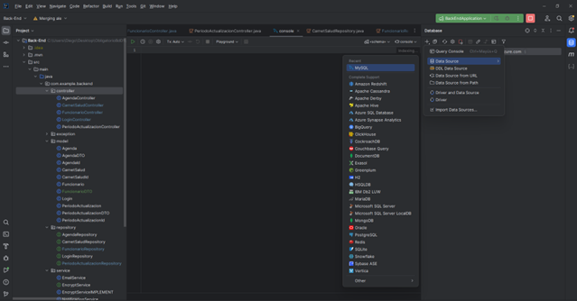
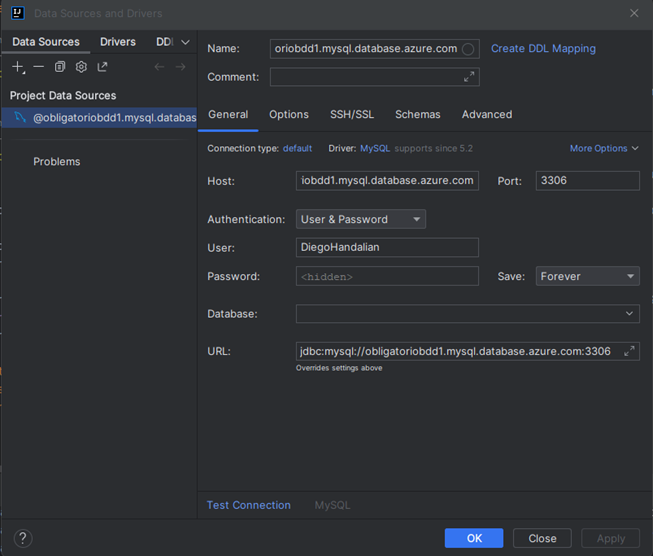

# ObligatorioBdD1

Integrantes :
Francisco Cabarcos
Alejandro Piccardo
Diego Handalian

Clonar Repositorio
Luego abrir en dos IDE distintos, el backend (IntelliJ) y el frontend (VSCode).
Para tener acceso a la base de datos, en el IntelliJ:

Ingresar los siguientes datos:
Host: obligatoriobdd1.mysql.database.azure.com
User: DiegoHandalian
Password: BaseDD2023
URL: jdbc:mysql://obligatoriobdd1.mysql.database.azure.com:3306

En VSCode dirigirse mediante consola a la carpeta obligatoriobdd1, ahí ingresar npm install y luego de terminado ng s, para correr el frontend, por el lado del backend cliquear en run.

Los puertos a utilizar son 3036 (Backend) y 4200 (Frontend)
En caso de no tener descargado el CLI de Angular, ingresar npm install -g @angular/cli

El Admin: 
LogId: 0
Contraseña: soyeladmin